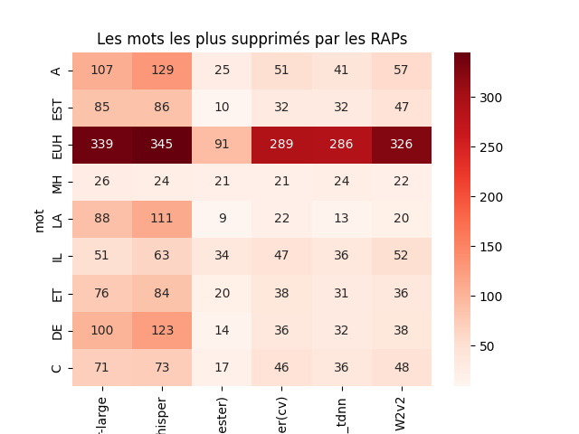
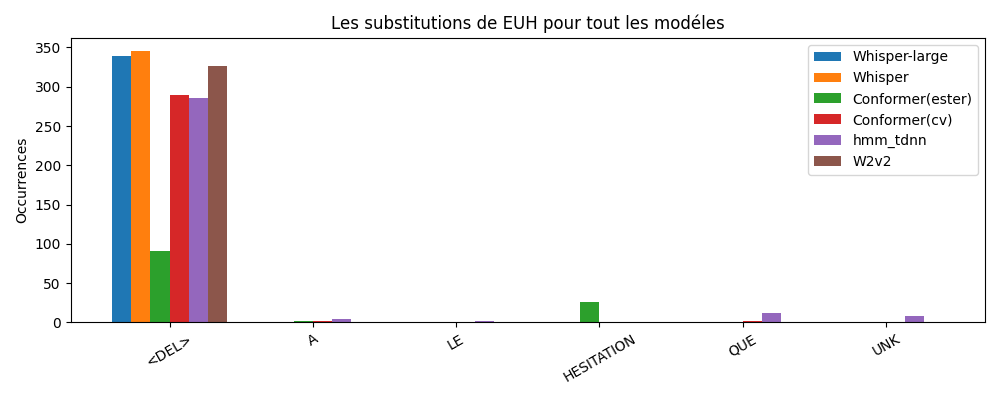
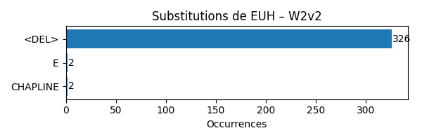
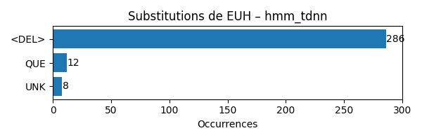
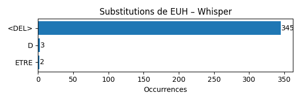
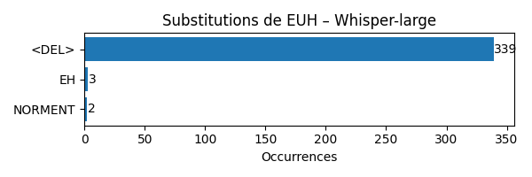
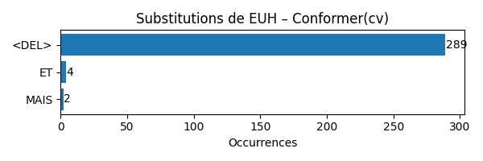
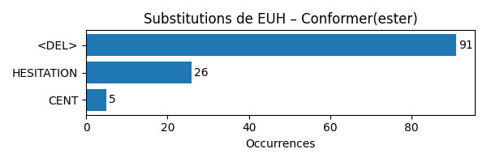
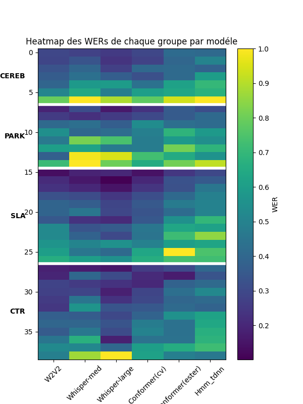

## Requirements


### Bash

```
pip install -r src/requirements.txt
```


## TAPAS-FRAIS DATASET
- Belge
- descriptive speech
- Good quality audio
- Semi Spontanous
- Word and phone transcription
- Manually Verified: people >= 50 years : 68 Tg
- Non verified: 49 Tg (47 found in folder)
- Duration per file: between 0.01 min and 4.99 min
- Duration of all dataset: 2h 48min 25s
- 128 wav file
- Sampling rate 44100
## Rhapsodie Dataset

## Models

- ##### asr-wav2vec2-commonvoice-fr( with CTC/Attention trained on CommonVoice French => WER=9.96) ==> [model](https://huggingface.co/speechbrain/asr-wav2vec2-commonvoice-fr):
    - Use LeBenchmark/wav2vec2-FR-7K-large
    - Tokenizer (unigram) that transforms words into subword units and trained with the train transcriptions (train.tsv) of CommonVoice (FR).
    - Acoustic model (wav2vec2.0 + CTC). A pretrained wav2vec 2.0 model (LeBenchmark/wav2vec2-FR-7K-large) is combined with two DNN layers and finetuned on CommonVoice FR. The obtained final acoustic representation is given to the CTC greedy decoder.
- ##### HMM-TDNN (trained on ester)

- ##### Conformer (trained on ester | Commonvoice)

- ##### Whisper-medium (finetuned on commonvoice-14.0)

## VAd+ chunking for whisper

Limits of applying whisper on data directly:
- Whisper is trained on short speech segments (30 sec), will split arbitrary
- Whisper may hallucinate during silent regions --> need of VAD
- Whisper drop uncertain speech --> incomplete transcriptions
- Whisper normalize and summarize transcription

==> VAD alone does change nothing, it even gave worser results than without

### Proposed solution:

- Applying VAD to decide where there is speech ==> Mark where speech is detected without removing silence or changing audio
- Speech segments produced by the VAD are grouped into chunks of maximum duration of 30 seconds. Consecutive speech segments separated by a pause ≤ 0.6 seconds are merged. Longer pauses create a new chunk.
With this method the original timestamp is preserved and we prevent over-segmentation caused by micro-pauses.
- Then, for each chunk, the audio is extracted directly from the original waveform using its timestamps and chunks are processed independently
- For models with VAD and with chunking, the audio files were resampled to 16KHz

| Datasets                       | Models                      | WER (silero)  | WER(rVAD)  |
|--------------------------------|-----------------------------|---------------|------------|
| TAPAS-FRAIS-verified           | asr-wav2vec2-commonvoice-fr | 24.63%        | /          |
| TAPAS-FRAIS-verified           | w2v2-VAD-chunk              | %             | **24.15%** |
| TAPAS-FRAIS-verified           | whisper-medium              | 59.81%        | /          |
| TAPAS-FRAIS-verified           | whisper-medium-VAD          | 62.39%        |            |
| TAPAS-FRAIS-verified           | whisper-medium-VAD-chunk    | 31.13%        | 31.64%     |
| TAPAS-FRAIS-verified           | whisper-Large-VAD-chunk     | 23.41%        | 24.79%     |

| Datasets             | Models            | WER (rVAD) | WER (Silero) | WER (rVAD-myconf) |
|----------------------|-------------------|------------|--------------|-------------------|
| TAPAS-FRAIS-verified | HMM-TDNN (ester)  | 27.13%     | /            | 24.59%            |
| TAPAS-FRAIS-verified | Conformer (ester) | 25.92%     | 24.79%       | 23.62%            |
| TAPAS-FRAIS-verified | Conformer (cv)    | 24.63%     | **24.26%**   | 26.87%            |

| Datasets                       | Models                      | WER (silero) | WER(rVAD) |
|--------------------------------|-----------------------------|--------------|-----------|
| TAPAS-FRAIS-non-verified       | whisper-Large-VAD-chunk     | 25.88%       | 36.20%    | 
| TAPAS-FRAIS-non-verified       | asr-wav2vec2-commonvoice-fr | **21.14%**   | /         |
| TAPAS-FRAIS-non-verified       | whisper-medium-VAD-chunk    | 34.44%       |           |
| TAPAS-FRAIS-non-verified       | whisper-medium              | 62.17%       | /         |


- Interpretation: With wav2vec the WER on non verified is always better than verified by human. But for whisper, the WER on verified is better than non verified, this could be explained by the fact that whisper has a closer transcriptions to human because it interprets speech.


| Datasets                 | Models                      | WER(Silero)    | WER (rVAD) | WER(rVAD-myconf) | WER (sans hesitation) | WER (sans hesitation ni rep) |
|--------------------------|-----------------------------|----------------|------------|------------------|-----------------------|------------------------------|
| Rhapsodie                | asr-wav2vec2-commonvoice-fr | 36.99%         | /          |                  |                       |                              |
| Rhapsodie                | wav2vec2-VAD-chunk          | %              |            | 27.78%           | 24.85%                | 24.56%                       |
| Rhapsodie                | Whisper-medium              | 67.05%         | /          |                  |                       |                              |
| Rhapsodie                | Whisper-medium-VAD-chunk    | 50.79%         |            | 48.24%           | 46.41%                | 46.49%                       |
| Rhapsodie                | Conformer (ester)           | **21.85%**     | 22.32%     | 24.08%           | 26.63%                | 27.28%                       |
| Rhapsodie                | Conformer (CV)              | 31.13%         | 29.77%     | 34.63%           | 32.28%                | 32.23%                       |
| Rhapsodie                | Whisper-large-VAD-chunk     | 45.73%         |            | 43.29%           | 40.72%                | 40.91%                       |
| Rhapsodie                | HMM-TDNN (ester)            | 28.74%(35.05%) | /          | 30.31%           | 28.16%                | 28.53%                       |
  -----------------------------------------------------------------------------------------------------------------------------------------------------------------
Dans la version Rhapsodie corrected, il y a des fichiers wav qui ont été retirés. 

Rhapsodie(corrected) on asr-wav2vec2-commonvoice-fr WER=33.75%     


Dans typaloc CEREB il y a un fichier .mix.textgrid a changer to .TextGrid

| Datasets          | Models                      | WER(sileroVAD) | WER (rVAD) | WER(rVAD-myconf) |
|-------------------|-----------------------------|----------------|------------|------------------|
| Typaloc (PARK-8)  | asr-wav2vec2-commonvoice-fr | 36.14%         | /          |                  |
| Typaloc (PARK-8)  | W2vec2_VAD_chunk            |                | 34.45%     | **34.45%**       |
| Typaloc (PARK-8)  | Whisper-medium              | 65.59%         | /          |                  |
| Typaloc (PARK-8)  | whisper-medium-VAD-chunk    | 46.37%         | 45.91%     | 45.91%           |
| Typaloc (PARK-8)  | whisper-large               | 55.85%         | /          |                  |
| Typaloc (PARK-8)  | whisper-large-VAD-chunk     | 40.37%         | 38.00%     | 38.00%           |
| Typaloc (PARK-8)  | Conformer (cv)              | **31.78%**     | 32.60%     | 37.69%           |
| Typaloc (PARK-8)  | Conformer (ester)           | 48.63%         | 47.56%     | 45.36%           |
| Typaloc (PARK-8)  | HMM-TDNN                    | 41.51%         | /          | 42.82%           |

| Datasets          | Models                      | WER(sileroVAD) | WER (rVAD) | WER(rVAD-myconf) |
|-------------------|-----------------------------|----------------|------------|------------------|
| Typaloc (CEREB-7) | asr-wav2vec2-commonvoice-fr | 38.89%         | /          |                  |
| Typaloc (CEREB-7) | w2v2_VAD_chunk              | %              | 34.66%     |  34.66%          |
| Typaloc (CEREB-7) | Whisper-medium              | 65.30%         | /          |                  |
| Typaloc (CEREB-7) | whisper-medium-VAD-chunk    | 39.72%         | 38.34%     |  38.34%          |
| Typaloc (CEREB-7) | whisper-large               | 57.91%         | /          |                  |
| Typaloc (CEREB-7) | whisper-large-VAD-chunk     | 36.08%         | **34.57%** | **34.57%**       |
| Typaloc (CEREB-7) | Conformer(cv)               | 38.07%         | 36.34%     |  36.36%          |
| Typaloc (CEREB-7) | Conformer(ester)            | 48.51%         | 46.05%     |  44.64%          |
| Typaloc (CEREB-7) | HMM-TDNN                    | 47.38%         | /          | 49.83%           |

| Datasets          | Models                      | WER (sileroVAD) | WER (rVAD)  | WER(rVAD-myconf) |
|-------------------|-----------------------------|-----------------|-------------|------------------|
| Typaloc (SLA-12)  | asr-wav2vec2-commonvoice-fr | 62.79%          | /           |                  |
| Typaloc (SLA-12)  | W2v2_VAD_chunk              | %               | 53.13%      | 53.13%           |
| Typaloc (SLA-12)  | Whisper-medium              | 65.08%          | /           |                  |
| Typaloc (SLA-12)  | whisper-medium-VAD-chunk    | 45.35%          | 42.95%      | 42.95%           |
| Typaloc (SLA-12)  | whisper-large               | 61.38%          | /           |                  |
| Typaloc (SLA-12)  | whisper-large-VAD-chunk     | 39.57%          | **38.29%**  | **38.29%**       |
| Typaloc (SLA-12)  | Conformer (cv)              | 54.10%          | 53.85%      | 50.03%           |
| Typaloc (SLA-12)  | Conformer(ester)            | 71.48%          | 72.25%      | 69.64%           |
| Typaloc (SLA-12)  | HMM-TDNN                    | 74.54%          | /           | 74.09%           |


| Datasets          | Models                      | WER (SileroVAD) | WER (rVAD)  | WER(rVAD-myconf) |
|-------------------|-----------------------------|-----------------|-------------|------------------|
| Typaloc (CTR-12)  | asr-wav2vec2-commonvoice-fr | 18.64%          | /           |                  |
| Typaloc (CTR-12)  | W2V2_VAD_chunk              |                 | 14.80%      | 14.80%           |
| Typaloc (CTR-12)  | Whisper-medium              | 60.18%          | /           |                  |
| Typaloc (CTR-12)  | whisper-medium-VAD-chunk    | 20.53%          | 19.85%      | 19.85%           |
| Typaloc (CTR-12)  | whisper-large               | 60.21%          | /           |                  |
| Typaloc (CTR-12)  | whisper-large-VAD-chunk     | 14.54%          | **13.46%**  | **13.46%**       |
| Typaloc (CTR-12)  | Conformer(cv)               | 15.01%          | 15.86%      | 16.98%           |
| Typaloc (CTR-12)  | Conformer(ester)            | 18.69%          | 20.72%      | 18.74%           |
| Typaloc (CTR-12)  | HMM-TDNN                    | 21.15%          | /           | 22.97%           |


### WER Analysis for datasets across ASR models
#### Rhapsodie dataset













#### TAPAS dataset


#### Typaloc dataset




Remarques: Typaloc CEREB: CCM-002710-01_L01.TextGrid la transcription est décalé au début, elle n'est pas fiable et elle contient le mot "respiration"
'a', 'jeimais', 'je', 'ne', 'jenase', 'pas', 'nonp', 'premiere', 'rencontre' ce n'est pas mis dans la trasncription ref mais il y a ces mots dans l'audio
il y a des mots bisarre comme: prov9, kutyrje,l9,s2l9pla,za,ze,z9z, [su=qui] [su],  (les) [su=villageois] viZ@Zwa [su],[su=lutins] detE [su], *syRl@plaSe*


Les hésitations de Rhapsodie:"euh","eh", "ben","hein","mh","mh","bah","hum"


Donnée Khalid
Spontannée

| Datasets  | Models                   | WER        | 
|-----------|--------------------------|------------|
| HC        | W2VEC-VAD-chunk          | **15.89%** |                                   
| HC        | Whisper-large-VAD-chunk  | 25.15%     |                                   
| HC        | Whisper-VAD-chunk        | 31.48%     |                                   
| HC        | Conf (cv)                | 21.37%     |                                   
| HC        | Conf (ester)             | 20.34%     |                                   
| HC        | Hmm_tdnn                 | 19.38%     |    

| Datasets | Models                  | WER        |
|----------|-------------------------|------------|
| PD       | W2VEC-VAD-chunk         | **24.20%** |                                   
| PD       | Whisper-large-VAD-chunk | 35.59%     |                                   
| PD       | Whisper-VAD-chunk       | 39.18%     |                                   
| PD       | Conf (cv)               | 30.96%     |                                   
| PD       | Conf (ester)            | 30.37%     |                                   
| PD       | Hmm-Tdnn                | 31.08%     |                                   

| Datasets | Models                  | WER        | 
|----------|-------------------------|------------|
| MSA      | W2VEC-VAD-chunk         | 27.27%     |                                   
| MSA      | Whisper-large-VAD-chunk | 36.14%     |                                   
| MSA      | Whisper-VAD-chunk       | 36.72%     |                                   
| MSA      | Conf (cv)               | 30.85%     |                                   
| MSA      | conf (ester)            | **25.66%** |                                   
| MSA      | Hmm-tdnn                | 37.28%     |


Donnée khalid lecture

| Datasets  | Models                   | WER | 
|-----------|--------------------------|-----|
| HC        | W2VEC-VAD-chunk          | %   |                                   
| HC        | Whisper-large-VAD-chunk  | %   |                                   
| HC        | Whisper-VAD-chunk        | %   |                                    
| HC        | Conf (cv)                | %   |                                   
| HC        | Conf (ester)             | %   |                                    
| HC        | Hmm_tdnn                 | %   |     
